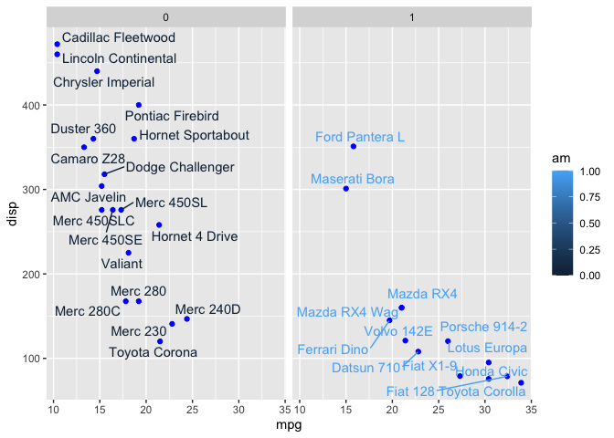

# Class 5: Data Viz with ggplot
Sawyer (PID: A69034741)

R has lot’s of ways to make figures and graphs in particular. One that
comes with R out of the box is called **“base” R** - the `plot()`
function.

``` r
plot(cars)
```


A very popular package in this area is called **ggplot2**.

Before I can use any add-on package like this I must install it with the
`install.packages("ggplot2")` command/function.

Then to use the package I need to load it with a `library(ggplot2)`
call.

``` r
# install.packages("ggplot2")
library(ggplot2)
ggplot(cars) +
  aes(x=speed, y=dist) +
  geom_point()
```


For “simple” plots like this one base R code will be much shorter than
ggplot code.

Let’s fit a model and show it on my plot:

``` r
library(ggplot2)
ggplot(cars) +
  aes(x=speed, y=dist) +
  geom_point() +
  geom_smooth()
```

    `geom_smooth()` using method = 'loess' and formula = 'y ~ x'


Every ggplot has at least 3 layers

- **data** (data.frame with the numbers or stuff you want to plot)
- **aes**thetics (mapping of your data columns to your plot)
- **geom**etries (there are tones of these, basics are `geom_point()`,
  `geom_line()`, `geom_col()`)

``` r
head(mtcars)
```

                       mpg cyl disp  hp drat    wt  qsec vs am gear carb
    Mazda RX4         21.0   6  160 110 3.90 2.620 16.46  0  1    4    4
    Mazda RX4 Wag     21.0   6  160 110 3.90 2.875 17.02  0  1    4    4
    Datsun 710        22.8   4  108  93 3.85 2.320 18.61  1  1    4    1
    Hornet 4 Drive    21.4   6  258 110 3.08 3.215 19.44  1  0    3    1
    Hornet Sportabout 18.7   8  360 175 3.15 3.440 17.02  0  0    3    2
    Valiant           18.1   6  225 105 2.76 3.460 20.22  1  0    3    1

Make me a ggplot of the ‘mtcars’ data set using `mpg` vs `disp` and set
the size of the points to the `hp` and set the color to `am`

``` r
library(ggplot2)
ggplot(mtcars) +
  aes(x=mpg, y=disp, size=hp, col=am) +
  geom_point()
```


``` r
library(ggplot2)
ggplot(mtcars) +
  aes(x=mpg, y=disp, size=hp, col=am) +
  geom_point(col='blue')
```


``` r
library(ggplot2)
ggplot(mtcars) +
  aes(x=mpg, y=disp, size=hp, col=am) +
  geom_point() +
  facet_wrap(~am)
```


``` r
library(ggplot2)
ggplot(mtcars) +
  aes(x=mpg, y=disp, size=hp, col=rownames(mtcars)) +
  geom_point() +
  facet_wrap(~am)
```


``` r
rownames(mtcars)
```

     [1] "Mazda RX4"           "Mazda RX4 Wag"       "Datsun 710"         
     [4] "Hornet 4 Drive"      "Hornet Sportabout"   "Valiant"            
     [7] "Duster 360"          "Merc 240D"           "Merc 230"           
    [10] "Merc 280"            "Merc 280C"           "Merc 450SE"         
    [13] "Merc 450SL"          "Merc 450SLC"         "Cadillac Fleetwood" 
    [16] "Lincoln Continental" "Chrysler Imperial"   "Fiat 128"           
    [19] "Honda Civic"         "Toyota Corolla"      "Toyota Corona"      
    [22] "Dodge Challenger"    "AMC Javelin"         "Camaro Z28"         
    [25] "Pontiac Firebird"    "Fiat X1-9"           "Porsche 914-2"      
    [28] "Lotus Europa"        "Ford Pantera L"      "Ferrari Dino"       
    [31] "Maserati Bora"       "Volvo 142E"         

``` r
library(ggrepel)
ggplot(mtcars) +
  aes(x=mpg, y=disp, label=rownames(mtcars), col=am) +
  geom_point(col='blue') +
  facet_wrap(~am) +
  geom_text_repel()
```



## Gene expression plot

``` r
url <- "https://bioboot.github.io/bimm143_S20/class-material/up_down_expression.txt"
genes <- read.delim(url)
head(genes)
```

            Gene Condition1 Condition2      State
    1      A4GNT -3.6808610 -3.4401355 unchanging
    2       AAAS  4.5479580  4.3864126 unchanging
    3      AASDH  3.7190695  3.4787276 unchanging
    4       AATF  5.0784720  5.0151916 unchanging
    5       AATK  0.4711421  0.5598642 unchanging
    6 AB015752.4 -3.6808610 -3.5921390 unchanging

``` r
colnames(genes)
```

    [1] "Gene"       "Condition1" "Condition2" "State"     

``` r
ncol(genes)
```

    [1] 4

``` r
library(ggplot2)
p <- ggplot(genes) +
      aes(x=Condition1, y=Condition2, color=State) +
      geom_point()
p + scale_colour_manual(values=c("blue","gray","red")) +
    labs(title="Gene Expresion Changes Upon Drug Treatment",
         x="Control (no drug) ",
         y="Drug Treatment")
```


``` r
nrow(genes)
```

    [1] 5196

There are 5196 genes in this dataset

``` r
unique(genes$State)
```

    [1] "unchanging" "up"         "down"      

The `table()` function is a super useful utility to tell me how many
entries of each type there are.

``` r
round(table (genes$State) / nrow(genes), 4)
```


          down unchanging         up 
        0.0139     0.9617     0.0244 

The functions `nrow()`, `ncol()`, and `table()` are ones I want you to
know.

``` r
library(dplyr)
```


    Attaching package: 'dplyr'

    The following objects are masked from 'package:stats':

        filter, lag

    The following objects are masked from 'package:base':

        intersect, setdiff, setequal, union

``` r
library(gapminder)


gapminder_2007 <- gapminder %>% filter(year==2007)

ggplot(gapminder_2007) +
  aes(x=gdpPercap, y=lifeExp) +
  geom_point(alpha=0.5)
```


``` r
ggplot(gapminder_2007) +
  aes(x=gdpPercap, y=lifeExp, color=continent, size=pop) +
  geom_point(alpha=0.5)
```


``` r
ggplot(gapminder_2007) + 
  aes(x = gdpPercap, y = lifeExp, size = pop) +
  geom_point(alpha=0.5)
```


``` r
gapminder_1957 <- gapminder %>% filter(year==1957)

ggplot(gapminder_1957) + 
  aes(x = gdpPercap, y = lifeExp, color=continent,
                 size = pop) +
  geom_point(alpha=0.7) + 
  scale_size_area(max_size = 10) 
```


``` r
gapminder_1957 <- gapminder %>% filter(year==1957 | year==2007)

ggplot(gapminder_1957) + 
  geom_point(aes(x = gdpPercap, y = lifeExp, color=continent,
                 size = pop), alpha=0.7) + 
  scale_size_area(max_size = 10) +
  facet_wrap(~year)
```


``` r
library(gapminder)
library(gganimate)

# Setup nice regular ggplot of the gapminder data
ggplot(gapminder, aes(gdpPercap, lifeExp, size = pop, colour = country)) +
  geom_point(alpha = 0.7, show.legend = FALSE) +
  scale_colour_manual(values = country_colors) +
  scale_size(range = c(2, 12)) +
  scale_x_log10() +
  # Facet by continent
  facet_wrap(~continent)
```


``` r
  # Here comes the gganimate specific bits
 # labs(title = 'Year: {frame_time}', x = 'GDP per capita', y = 'life expectancy') +
 # transition_time(year) +
 # shadow_wake(wake_length = 0.1, alpha = FALSE)
```

``` r
head(gapminder)
```

    # A tibble: 6 × 6
      country     continent  year lifeExp      pop gdpPercap
      <fct>       <fct>     <int>   <dbl>    <int>     <dbl>
    1 Afghanistan Asia       1952    28.8  8425333      779.
    2 Afghanistan Asia       1957    30.3  9240934      821.
    3 Afghanistan Asia       1962    32.0 10267083      853.
    4 Afghanistan Asia       1967    34.0 11537966      836.
    5 Afghanistan Asia       1972    36.1 13079460      740.
    6 Afghanistan Asia       1977    38.4 14880372      786.
