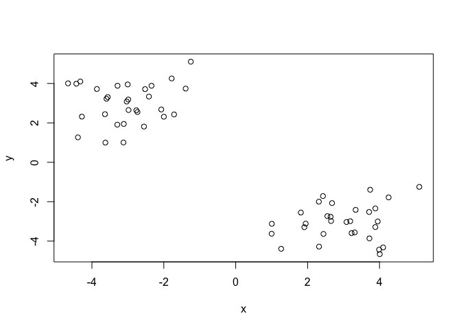
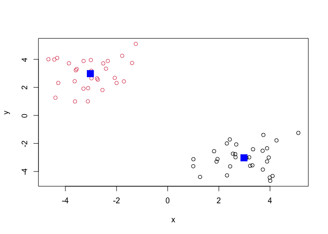
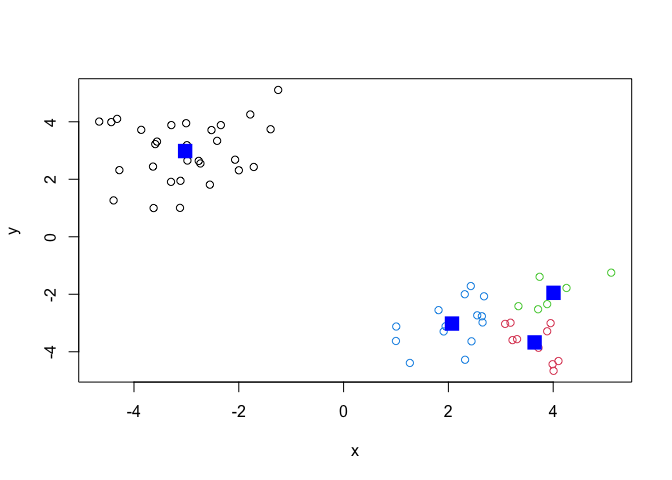
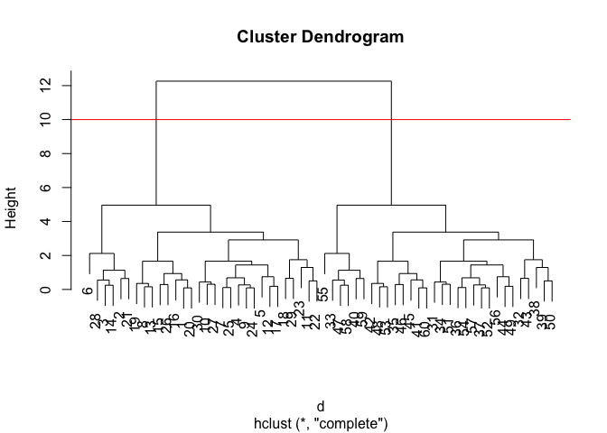
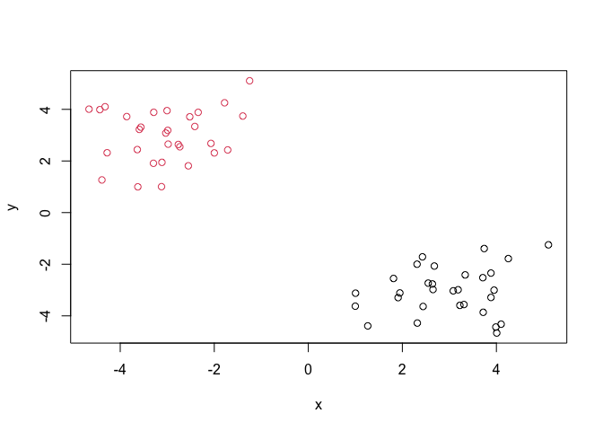
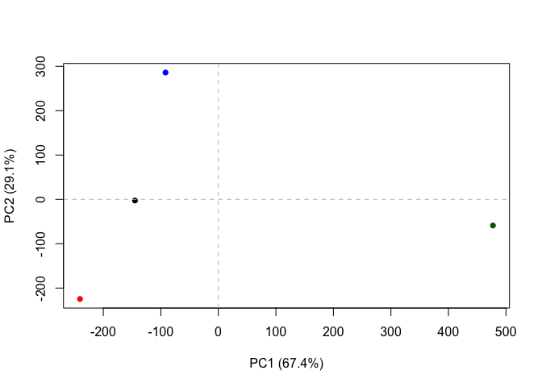

# Class 7: Machine Learning 1
Sawyer Randles (A69034741)

Before we get into clustering methods let’s make some sample data to
cluster where we know what the answer should be.

To help with this I will use the `rnorm()` function.

``` r
n=30
x <- c(rnorm(n, mean=3), rnorm(n, mean=-3))
y <- rev(x)
z <- cbind(x,y)
plot(z)
```



## K-mean clustering

The function in base R for k-means clustering is called `kmeans()`.

``` r
km <- kmeans(z, 2)
km
```

    K-means clustering with 2 clusters of sizes 30, 30

    Cluster means:
              x         y
    1  2.981482 -3.023954
    2 -3.023954  2.981482

    Clustering vector:
     [1] 1 1 1 1 1 1 1 1 1 1 1 1 1 1 1 1 1 1 1 1 1 1 1 1 1 1 1 1 1 1 2 2 2 2 2 2 2 2
    [39] 2 2 2 2 2 2 2 2 2 2 2 2 2 2 2 2 2 2 2 2 2 2

    Within cluster sum of squares by cluster:
    [1] 54.90037 54.90037
     (between_SS / total_SS =  90.8 %)

    Available components:

    [1] "cluster"      "centers"      "totss"        "withinss"     "tot.withinss"
    [6] "betweenss"    "size"         "iter"         "ifault"      

``` r
km$centers
```

              x         y
    1  2.981482 -3.023954
    2 -3.023954  2.981482

> Q. Print out the cluster membership vector (i.e. our main answer)

``` r
km$cluster
```

     [1] 1 1 1 1 1 1 1 1 1 1 1 1 1 1 1 1 1 1 1 1 1 1 1 1 1 1 1 1 1 1 2 2 2 2 2 2 2 2
    [39] 2 2 2 2 2 2 2 2 2 2 2 2 2 2 2 2 2 2 2 2 2 2

Plot with clustering result and add cluster centers:

``` r
plot(z, col=km$cluster)
points(km$centers, col="blue", pch=15, cex=2)
```



> Q. Can you cluster our data in ‘z’ into four clusters please?

``` r
km4 <- kmeans(z, 4)
plot(z, col=km4$cluster)
points(km4$centers, col="blue", pch=15, cex=2)
```



Scree Plot - scree is rubble at the base of a cliff - big drop at the
cliff, A way to tell how many clusters you want - looks for inflection
point in sum of squares (ss) vs k plot - you want the drop off - where
each change in k clusters results in a smaller decrease in ss - it will
always decrease as the points will always be closer together with
infinitely more clusters, but after a certain point there are
diminishing returns Won’t always be an inflection point, means there
isnt great reason for you to choose that number of clusters kmeans is
super quick, works well with large datasets, will do everything for
your, but will always give you an answer, whatever you ask it for

## Hirarchical Clustering

The main function for hierarchical clustering in base R is called
`hclust()`

Unlike `kmeans()` I can not just pass in my data as input I first need a
distance matrix from my data.

dist - can feed it anything that is a number describing how far apart
points are - in euclidian space, manhattan distance etc

object oriented - means it has methods specific for type of object

height of bar means that those points are more different - more
separation means more dissimilarities between data that it separates

cut like a tree where it is easiest to cut, have largest height, and
separate so that you have the most leaves attached to the branch below

``` r
?hclust()
```

``` r
d <- dist(z)
hc <- hclust(d)
hc
```


    Call:
    hclust(d = d)

    Cluster method   : complete 
    Distance         : euclidean 
    Number of objects: 60 

There is a specific hclust plot() method…

``` r
plot(hc)
abline(h=10, col='red')
```



To get my main clustering result (i.e. the membership vector) I can
“cut” my tree at a given height. To do this I will use the ‘cutree()’
function

``` r
grps <- cutree(hc, h=10)
# can also use arguement k for specifying how many clusters you want - h specifies height, k specifies clusters
plot(z, col=grps)
```



## Principal Component Analysis

Used anywhere there are lots of observations and you want to look for
larger patterns Similar to principal coordinate analysis - coordinate is
with distance matrix instead of covariance matrix (component)

Sets up new axes that are better - data is more spread along the axis
meaning that it captures the most variance in the data

Principal component analysis (PCA) is a well established “multivariate
statistical technique” used to reduce the dimensionality of a complex
data set to a more manageable number (typically 2D or 3D). This method
is particularly useful for highlighting strong paterns and relationships
in large datasets (i.e. revealing major similarities and diferences)
that are otherwise hard to visualize. As we will see again and again in
this course PCA is often used to make all sorts of bioinformatics data
easy to explore and visualize.

Axes always has to be perpendicular - how is this accounted for in math?
Doesnt just maximize PC1 - it maximizes explaining the total variance in
two variables/dimensions - can you run PCA with more than 2 dimensions?

``` r
url <- "https://tinyurl.com/UK-foods"
x <- read.csv(url, row.names = 1)
x
```

                        England Wales Scotland N.Ireland
    Cheese                  105   103      103        66
    Carcass_meat            245   227      242       267
    Other_meat              685   803      750       586
    Fish                    147   160      122        93
    Fats_and_oils           193   235      184       209
    Sugars                  156   175      147       139
    Fresh_potatoes          720   874      566      1033
    Fresh_Veg               253   265      171       143
    Other_Veg               488   570      418       355
    Processed_potatoes      198   203      220       187
    Processed_Veg           360   365      337       334
    Fresh_fruit            1102  1137      957       674
    Cereals                1472  1582     1462      1494
    Beverages                57    73       53        47
    Soft_drinks            1374  1256     1572      1506
    Alcoholic_drinks        375   475      458       135
    Confectionery            54    64       62        41

``` r
## Q1. How many rows and columns are in your new data frame named x? What R functions could you use to answer this questions?

## Complete the following code to find out how many rows and columns are in x?
dim(x)
```

    [1] 17  4

``` r
head(x)
```

                   England Wales Scotland N.Ireland
    Cheese             105   103      103        66
    Carcass_meat       245   227      242       267
    Other_meat         685   803      750       586
    Fish               147   160      122        93
    Fats_and_oils      193   235      184       209
    Sugars             156   175      147       139

``` r
tail(x)
```

                      England Wales Scotland N.Ireland
    Fresh_fruit          1102  1137      957       674
    Cereals              1472  1582     1462      1494
    Beverages              57    73       53        47
    Soft_drinks          1374  1256     1572      1506
    Alcoholic_drinks      375   475      458       135
    Confectionery          54    64       62        41

``` r
barplot(as.matrix(x), beside=T, col=rainbow(nrow(x)))
```


``` r
pairs(x, col=rainbow(10), pch=16)
```


## PCA to the rescue

The main function to do PCA in base R is called ‘prcomp()’

``` r
# Use the prcomp() PCA function 
# You want the things you care about - like gene expression data - in columns
# Use t to transpose the data
pca <- prcomp( t(x) )
summary(pca)
```

    Importance of components:
                                PC1      PC2      PC3       PC4
    Standard deviation     324.1502 212.7478 73.87622 3.176e-14
    Proportion of Variance   0.6744   0.2905  0.03503 0.000e+00
    Cumulative Proportion    0.6744   0.9650  1.00000 1.000e+00

Let’s see what is inside our result object `pca` that we just calculated

``` r
attributes(pca)
```

    $names
    [1] "sdev"     "rotation" "center"   "scale"    "x"       

    $class
    [1] "prcomp"

``` r
pca$x
```

                     PC1         PC2        PC3           PC4
    England   -144.99315   -2.532999 105.768945 -4.894696e-14
    Wales     -240.52915 -224.646925 -56.475555  5.700024e-13
    Scotland   -91.86934  286.081786 -44.415495 -7.460785e-13
    N.Ireland  477.39164  -58.901862  -4.877895  2.321303e-13

To make our main result figure, called a “PC plot” (or “score plot”,
“ordination plot or”PC1 vs PC2 plot”.)

``` r
plot(pca$x[,1], pca$x[,2],
     col=c("black", "red", "blue", "darkgreen"),
     pch=16, xlab="PC1 (67.4%)", ylab="PC2 (29.1%)")
abline(h=0, col='gray', lty=2)
abline(v=0, col='gray', lty=2)
```



## Variable loadings plot

Can give us insight on how the original variables (in this case the
foods) contribute to our new PC axis

``` r
## Lets focus on PC1 as it accounts for > 90% of variance 
par(mar=c(10, 3, 0.35, 0))
barplot( pca$rotation[,1], las=2 )
```


