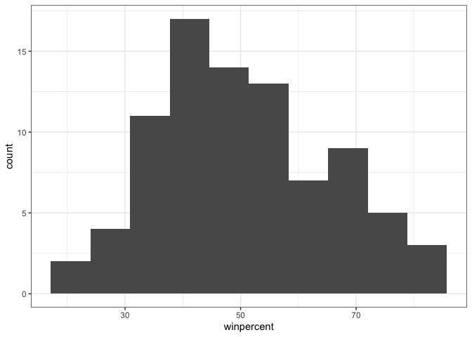
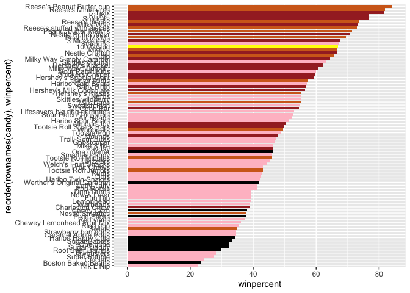
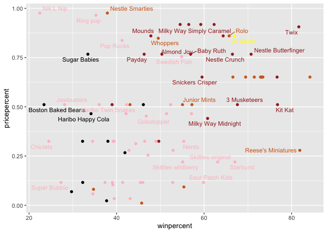
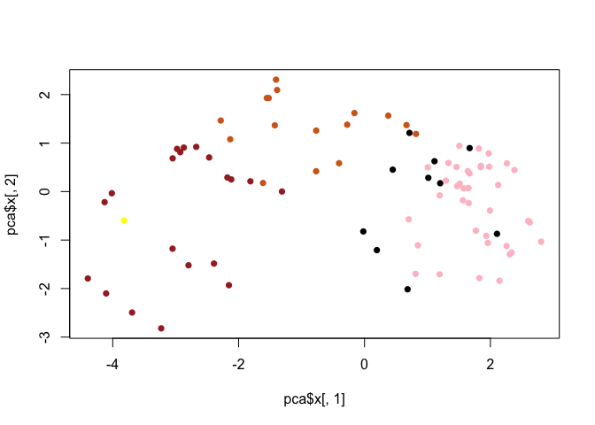
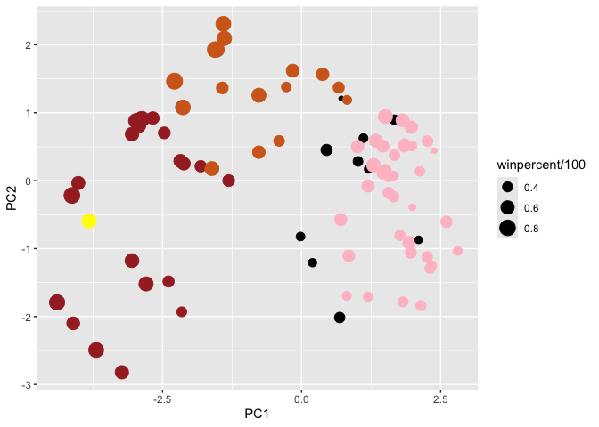
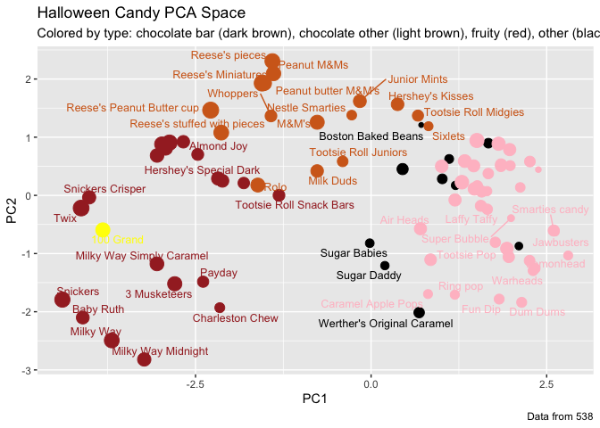
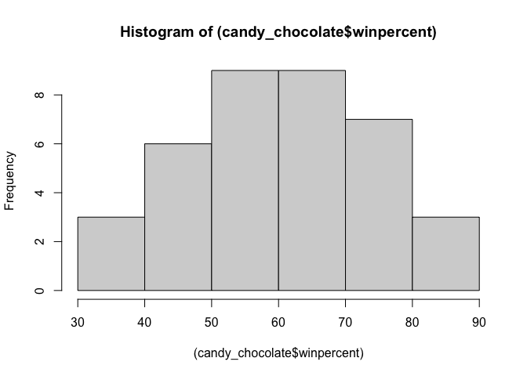
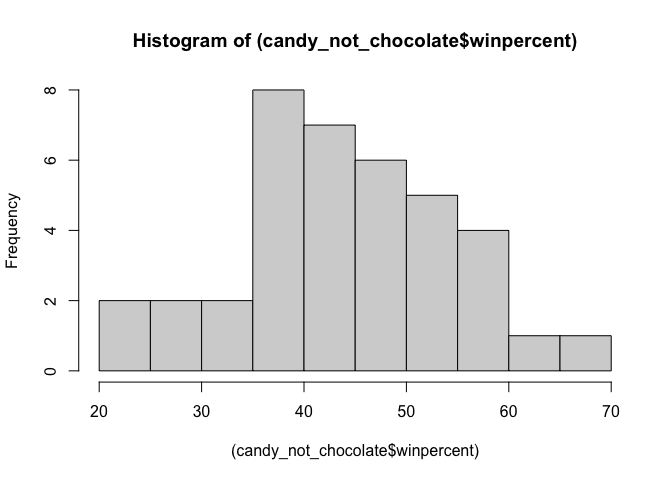

# Class 9: Halloween Candy Mini-Project
Sawyer Randles, PID: A69034741

``` r
candy_file <- "candy-data.csv"

candy = read.csv(candy_file, row.names=1)
head(candy)
```

                 chocolate fruity caramel peanutyalmondy nougat crispedricewafer
    100 Grand            1      0       1              0      0                1
    3 Musketeers         1      0       0              0      1                0
    One dime             0      0       0              0      0                0
    One quarter          0      0       0              0      0                0
    Air Heads            0      1       0              0      0                0
    Almond Joy           1      0       0              1      0                0
                 hard bar pluribus sugarpercent pricepercent winpercent
    100 Grand       0   1        0        0.732        0.860   66.97173
    3 Musketeers    0   1        0        0.604        0.511   67.60294
    One dime        0   0        0        0.011        0.116   32.26109
    One quarter     0   0        0        0.011        0.511   46.11650
    Air Heads       0   0        0        0.906        0.511   52.34146
    Almond Joy      0   1        0        0.465        0.767   50.34755

``` r
nrow(candy)
```

    [1] 85

``` r
sum(candy$fruity)
```

    [1] 38

> Q1. How many different candy types are in this dataset?

85

> Q2. How many fruity candy types are in the dataset?

38

``` r
candy["100 Grand", ]$winpercent
```

    [1] 66.97173

> Q3. What is your favorite candy in the dataset and what is it’s
> winpercent value?

100 Grand - 66.97173

> Q4. What is the winpercent value for “Kit Kat”?

76.7686

> Q5. What is the winpercent value for “Tootsie Roll Snack Bars”?

49.6535

``` r
#install.packages("skimr")
library("skimr")
skim(candy)
```

|                                                  |       |
|:-------------------------------------------------|:------|
| Name                                             | candy |
| Number of rows                                   | 85    |
| Number of columns                                | 12    |
| \_\_\_\_\_\_\_\_\_\_\_\_\_\_\_\_\_\_\_\_\_\_\_   |       |
| Column type frequency:                           |       |
| numeric                                          | 12    |
| \_\_\_\_\_\_\_\_\_\_\_\_\_\_\_\_\_\_\_\_\_\_\_\_ |       |
| Group variables                                  | None  |

Data summary

**Variable type: numeric**

| skim_variable | n_missing | complete_rate | mean | sd | p0 | p25 | p50 | p75 | p100 | hist |
|:---|---:|---:|---:|---:|---:|---:|---:|---:|---:|:---|
| chocolate | 0 | 1 | 0.44 | 0.50 | 0.00 | 0.00 | 0.00 | 1.00 | 1.00 | ▇▁▁▁▆ |
| fruity | 0 | 1 | 0.45 | 0.50 | 0.00 | 0.00 | 0.00 | 1.00 | 1.00 | ▇▁▁▁▆ |
| caramel | 0 | 1 | 0.16 | 0.37 | 0.00 | 0.00 | 0.00 | 0.00 | 1.00 | ▇▁▁▁▂ |
| peanutyalmondy | 0 | 1 | 0.16 | 0.37 | 0.00 | 0.00 | 0.00 | 0.00 | 1.00 | ▇▁▁▁▂ |
| nougat | 0 | 1 | 0.08 | 0.28 | 0.00 | 0.00 | 0.00 | 0.00 | 1.00 | ▇▁▁▁▁ |
| crispedricewafer | 0 | 1 | 0.08 | 0.28 | 0.00 | 0.00 | 0.00 | 0.00 | 1.00 | ▇▁▁▁▁ |
| hard | 0 | 1 | 0.18 | 0.38 | 0.00 | 0.00 | 0.00 | 0.00 | 1.00 | ▇▁▁▁▂ |
| bar | 0 | 1 | 0.25 | 0.43 | 0.00 | 0.00 | 0.00 | 0.00 | 1.00 | ▇▁▁▁▂ |
| pluribus | 0 | 1 | 0.52 | 0.50 | 0.00 | 0.00 | 1.00 | 1.00 | 1.00 | ▇▁▁▁▇ |
| sugarpercent | 0 | 1 | 0.48 | 0.28 | 0.01 | 0.22 | 0.47 | 0.73 | 0.99 | ▇▇▇▇▆ |
| pricepercent | 0 | 1 | 0.47 | 0.29 | 0.01 | 0.26 | 0.47 | 0.65 | 0.98 | ▇▇▇▇▆ |
| winpercent | 0 | 1 | 50.32 | 14.71 | 22.45 | 39.14 | 47.83 | 59.86 | 84.18 | ▃▇▆▅▂ |

``` r
library(dplyr)
```


    Attaching package: 'dplyr'

    The following objects are masked from 'package:stats':

        filter, lag

    The following objects are masked from 'package:base':

        intersect, setdiff, setequal, union

``` r
candy |>
  filter(rownames(candy) %in% c("Dum Dums", "Twix")) |>
  select(winpercent)
```

             winpercent
    Dum Dums   39.46056
    Twix       81.64291

> Q6. Is there any variable/column that looks to be on a different scale
> to the majority of the other columns in the dataset?

winpercent - mean is 2 orders of magnitude higher

> Q7. What do you think a zero and one represent for the
> candy\$chocolate column?

Zero means it does not contain chocolate, one means it contains
chocolate

> Q8. Plot a histogram of winpercent values

``` r
hist(candy$winpercent, breaks = 10)
```


``` r
library(ggplot2)

ggplot(candy) +
  aes(winpercent) +
  geom_histogram(bins=10) +
  theme_bw()
```



> Q9. Is the distribution of winpercent values symmetrical?

No - there is a longer tail toward the higher win percent values

> Q10. Is the center of the distribution above or below 50%?

Below

``` r
candy |>
  filter(winpercent > 75) |>
  filter(pricepercent < 0.5)
```

                       chocolate fruity caramel peanutyalmondy nougat
    Reese's Miniatures         1      0       0              1      0
                       crispedricewafer hard bar pluribus sugarpercent pricepercent
    Reese's Miniatures                0    0   0        0        0.034        0.279
                       winpercent
    Reese's Miniatures   81.86626

``` r
inds <- candy$chocolate == 1
choc.win <- candy[inds,]$winpercent

inds <- candy$fruity == 1
fruit.win <- candy[inds,]$winpercent
```

``` r
mean(candy$winpercent[as.logical(candy$chocolate)])
```

    [1] 60.92153

``` r
mean(candy$winpercent[as.logical(candy$fruity)])
```

    [1] 44.11974

``` r
summary(candy$winpercent)
```

       Min. 1st Qu.  Median    Mean 3rd Qu.    Max. 
      22.45   39.14   47.83   50.32   59.86   84.18 

``` r
summary(choc.win)
```

       Min. 1st Qu.  Median    Mean 3rd Qu.    Max. 
      34.72   50.35   60.80   60.92   70.74   84.18 

``` r
summary(fruit.win)
```

       Min. 1st Qu.  Median    Mean 3rd Qu.    Max. 
      22.45   39.04   42.97   44.12   52.11   67.04 

``` r
t.test(x= candy$winpercent[as.logical(candy$chocolate)],
       y=(candy$winpercent[as.logical(candy$fruity)])
)
```


        Welch Two Sample t-test

    data:  candy$winpercent[as.logical(candy$chocolate)] and (candy$winpercent[as.logical(candy$fruity)])
    t = 6.2582, df = 68.882, p-value = 2.871e-08
    alternative hypothesis: true difference in means is not equal to 0
    95 percent confidence interval:
     11.44563 22.15795
    sample estimates:
    mean of x mean of y 
     60.92153  44.11974 

> Q11. On average is chocolate candy higher or lower ranked than fruit
> candy?

Chocolate candy is ranked higher than fruit candy on average

> Q12. Is this difference statistically significant?

Yes, with an alpha 0.5

``` r
candy %>%
  arrange(winpercent) %>%
  tail(5)
```

                              chocolate fruity caramel peanutyalmondy nougat
    Snickers                          1      0       1              1      1
    Kit Kat                           1      0       0              0      0
    Twix                              1      0       1              0      0
    Reese's Miniatures                1      0       0              1      0
    Reese's Peanut Butter cup         1      0       0              1      0
                              crispedricewafer hard bar pluribus sugarpercent
    Snickers                                 0    0   1        0        0.546
    Kit Kat                                  1    0   1        0        0.313
    Twix                                     1    0   1        0        0.546
    Reese's Miniatures                       0    0   0        0        0.034
    Reese's Peanut Butter cup                0    0   0        0        0.720
                              pricepercent winpercent
    Snickers                         0.651   76.67378
    Kit Kat                          0.511   76.76860
    Twix                             0.906   81.64291
    Reese's Miniatures               0.279   81.86626
    Reese's Peanut Butter cup        0.651   84.18029

There are two related fnctions that are useful here `sort()` and
`order()`

``` r
play <- c(2,1,5,3)
sort(play)
```

    [1] 1 2 3 5

``` r
order(play)
```

    [1] 2 1 4 3

``` r
inds <- order(candy$winpercent, decreasing=F)
head(candy[inds,])
```

                       chocolate fruity caramel peanutyalmondy nougat
    Nik L Nip                  0      1       0              0      0
    Boston Baked Beans         0      0       0              1      0
    Chiclets                   0      1       0              0      0
    Super Bubble               0      1       0              0      0
    Jawbusters                 0      1       0              0      0
    Root Beer Barrels          0      0       0              0      0
                       crispedricewafer hard bar pluribus sugarpercent pricepercent
    Nik L Nip                         0    0   0        1        0.197        0.976
    Boston Baked Beans                0    0   0        1        0.313        0.511
    Chiclets                          0    0   0        1        0.046        0.325
    Super Bubble                      0    0   0        0        0.162        0.116
    Jawbusters                        0    1   0        1        0.093        0.511
    Root Beer Barrels                 0    1   0        1        0.732        0.069
                       winpercent
    Nik L Nip            22.44534
    Boston Baked Beans   23.41782
    Chiclets             24.52499
    Super Bubble         27.30386
    Jawbusters           28.12744
    Root Beer Barrels    29.70369

> Q13. What are the five least liked candy types in this set?

Nik L Nip, Boston Baked Beans, Chiclets, Super Bubble, Jawbusters

> Q14. What are the top 5 all time favorite candy types out of this set?

Snickers, Kit Kat, Twix, Reese’s Miniatures, Reese’s Peanut Butter Cup

> Q15. Make a first barplot of candy ranking based on winpercent values.

``` r
library(ggplot2)

ggplot(candy) + 
  aes(winpercent, rownames(candy)) +
  geom_col()
```


> Q16. This is quite ugly, use the reorder() function to get the bars
> sorted by winpercent?

``` r
library(ggplot2)

ggplot(candy) + 
  aes(winpercent, reorder(rownames(candy),winpercent)) +
  geom_col()
```


> Q. Color your favorite candy your favourite color

``` r
my_cols=rep("black", nrow(candy))
my_cols[as.logical(candy$chocolate)] = "chocolate"
my_cols[as.logical(candy$bar)] = "brown"
my_cols[as.logical(candy$fruity)] = "pink"
my_cols[rownames(candy) == "100 Grand"] = "yellow"
```

``` r
ggplot(candy) + 
  aes(winpercent, reorder(rownames(candy),winpercent)) +
  geom_col(fill=my_cols) 
```



``` r
?rep()
```

> Q17. What is the worst ranked chocolate candy?

Sixlets

> Q18. What is the best ranked fruity candy?

Starburst

``` r
library(ggrepel)

# How about a plot of price vs win
ggplot(candy) +
  aes(winpercent, pricepercent, label=rownames(candy)) +
  geom_point(col=my_cols) + 
  geom_text_repel(col=my_cols, size=3.3, max.overlaps = 5)
```

    Warning: ggrepel: 50 unlabeled data points (too many overlaps). Consider
    increasing max.overlaps



> Q19. Which candy type is the highest ranked in terms of winpercent for
> the least money - i.e. offers the most bang for your buck?

Reese’s Miniatures

``` r
ord <- order(candy$pricepercent, decreasing = TRUE)
head( candy[ord,c(11,12)], n=5 )
```

                             pricepercent winpercent
    Nik L Nip                       0.976   22.44534
    Nestle Smarties                 0.976   37.88719
    Ring pop                        0.965   35.29076
    Hershey's Krackel               0.918   62.28448
    Hershey's Milk Chocolate        0.918   56.49050

> Q20. What are the top 5 most expensive candy types in the dataset and
> of these which is the least popular?

Nik L Nip - least popular Nestle Smarties Ring pop  
Hershey’s Krackel Hershey’s Milk Chocolate

``` r
cij <- cor(candy)

#install.packages("corrplot")
library(corrplot)
```

    corrplot 0.95 loaded

``` r
corrplot(cij)
```


## Principal Component Analysis

``` r
pca <- prcomp(candy, scale=TRUE)
summary(pca)
```

    Importance of components:
                              PC1    PC2    PC3     PC4    PC5     PC6     PC7
    Standard deviation     2.0788 1.1378 1.1092 1.07533 0.9518 0.81923 0.81530
    Proportion of Variance 0.3601 0.1079 0.1025 0.09636 0.0755 0.05593 0.05539
    Cumulative Proportion  0.3601 0.4680 0.5705 0.66688 0.7424 0.79830 0.85369
                               PC8     PC9    PC10    PC11    PC12
    Standard deviation     0.74530 0.67824 0.62349 0.43974 0.39760
    Proportion of Variance 0.04629 0.03833 0.03239 0.01611 0.01317
    Cumulative Proportion  0.89998 0.93832 0.97071 0.98683 1.00000

``` r
pca
```

    Standard deviations (1, .., p=12):
     [1] 2.0787503 1.1378302 1.1091894 1.0753337 0.9518204 0.8192321 0.8153014
     [8] 0.7452991 0.6782391 0.6234867 0.4397418 0.3976039

    Rotation (n x k) = (12 x 12):
                            PC1         PC2         PC3          PC4          PC5
    chocolate        -0.4019466  0.21404160  0.01601358 -0.016673032  0.066035846
    fruity            0.3683883 -0.18304666 -0.13765612 -0.004479829  0.143535325
    caramel          -0.2299709 -0.40349894 -0.13294166 -0.024889542 -0.507301501
    peanutyalmondy   -0.2407155  0.22446919  0.18272802  0.466784287  0.399930245
    nougat           -0.2268102 -0.47016599  0.33970244  0.299581403 -0.188852418
    crispedricewafer -0.2215182  0.09719527 -0.36485542 -0.605594730  0.034652316
    hard              0.2111587 -0.43262603 -0.20295368 -0.032249660  0.574557816
    bar              -0.3947433 -0.22255618  0.10696092 -0.186914549  0.077794806
    pluribus          0.2600041  0.36920922 -0.26813772  0.287246604 -0.392796479
    sugarpercent     -0.1083088 -0.23647379 -0.65509692  0.433896248  0.007469103
    pricepercent     -0.3207361  0.05883628 -0.33048843  0.063557149  0.043358887
    winpercent       -0.3298035  0.21115347 -0.13531766  0.117930997  0.168755073
                             PC6         PC7         PC8          PC9         PC10
    chocolate        -0.09018950 -0.08360642 -0.49084856 -0.151651568  0.107661356
    fruity           -0.04266105  0.46147889  0.39805802 -0.001248306  0.362062502
    caramel          -0.40346502 -0.44274741  0.26963447  0.019186442  0.229799010
    peanutyalmondy   -0.09416259 -0.25710489  0.45771445  0.381068550 -0.145912362
    nougat            0.09012643  0.36663902 -0.18793955  0.385278987  0.011323453
    crispedricewafer -0.09007640  0.13077042  0.13567736  0.511634999 -0.264810144
    hard             -0.12767365 -0.31933477 -0.38881683  0.258154433  0.220779142
    bar               0.25307332  0.24192992 -0.02982691  0.091872886 -0.003232321
    pluribus          0.03184932  0.04066352 -0.28652547  0.529954405  0.199303452
    sugarpercent      0.02737834  0.14721840 -0.04114076 -0.217685759 -0.488103337
    pricepercent      0.62908570 -0.14308215  0.16722078 -0.048991557  0.507716043
    winpercent       -0.56947283  0.40260385 -0.02936405 -0.124440117  0.358431235
                            PC11        PC12
    chocolate         0.10045278  0.69784924
    fruity            0.17494902  0.50624242
    caramel           0.13515820  0.07548984
    peanutyalmondy    0.11244275  0.12972756
    nougat           -0.38954473  0.09223698
    crispedricewafer -0.22615618  0.11727369
    hard              0.01342330 -0.10430092
    bar               0.74956878 -0.22010569
    pluribus          0.27971527 -0.06169246
    sugarpercent      0.05373286  0.04733985
    pricepercent     -0.26396582 -0.06698291
    winpercent       -0.11251626 -0.37693153

``` r
plot(pca$x[,1], pca$x[,2], col=my_cols, pch=16)
```



A ggplot version of our PCA plot

``` r
# Make a new data-frame with our PCA results and candy data
my_data <- cbind(candy, pca$x[,1:3])
```

``` r
p <- ggplot(my_data) + 
        aes(x=PC1, y=PC2, 
            size=winpercent/100,  
            text=rownames(my_data),
            label=rownames(my_data)) +
        geom_point(col=my_cols)

p
```



``` r
library(ggrepel)

p + geom_text_repel(size=3.3, col=my_cols, max.overlaps = 7)  + 
  theme(legend.position = "none") +
  labs(title="Halloween Candy PCA Space",
       subtitle="Colored by type: chocolate bar (dark brown), chocolate other (light brown), fruity (red), other (black)",
       caption="Data from 538")
```

    Warning: ggrepel: 39 unlabeled data points (too many overlaps). Consider
    increasing max.overlaps



``` r
pca$rotation[,1]
```

           chocolate           fruity          caramel   peanutyalmondy 
          -0.4019466        0.3683883       -0.2299709       -0.2407155 
              nougat crispedricewafer             hard              bar 
          -0.2268102       -0.2215182        0.2111587       -0.3947433 
            pluribus     sugarpercent     pricepercent       winpercent 
           0.2600041       -0.1083088       -0.3207361       -0.3298035 

``` r
par(mar=c(8,4,2,2))
barplot(pca$rotation[,1], las=2, ylab="PC1 Contribution")
```


**NOTES**

The `%in%` operator is useful for checking the intersection of two
vectors.

``` r
c("barry", "liz", "chandra") %in% c("paul", "alice", "liz")
```

    [1] FALSE  TRUE FALSE

``` r
candy_chocolate <-
  candy |>
  filter(chocolate == 1)

candy_not_chocolate <-
  candy |>
  filter(fruity == 1)
```

``` r
hist((candy_chocolate$winpercent))
```



``` r
hist((candy_not_chocolate$winpercent))
```



``` r
play <- c("sawyer", "barry")
rep(play, each = 3)
```

    [1] "sawyer" "sawyer" "sawyer" "barry"  "barry"  "barry" 
